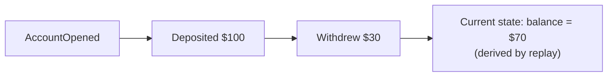

# Event-Driven Architecture

Components communicate by producing and reacting to events instead of
calling each other directly, decoupling producers from consumers in both
time and identity.

## Queues vs topics

| | Queue (point-to-point) | Topic (pub/sub) |
|---|---|---|
| Delivery | One consumer per message | Every subscriber gets the message |
| Use case | Distributing work across a worker pool | Broadcasting a fact ("order placed") |

## Delivery guarantees

- **At-most-once** — may lose messages, never duplicates. Fine for data you
  can afford to drop (some metrics).
- **At-least-once** — never loses messages, may duplicate. The common
  default — requires **idempotent** consumers.
- **Exactly-once** — the ideal; in practice approximated via at-least-once
  + deduplication (idempotency keys), rather than a true guarantee.

## Event sourcing

Store every state change as an immutable event instead of just the current
state. Current state is derived by replaying events from the beginning (or
from a snapshot).

Benefits: full audit trail, ability to reconstruct state at any point in
time, natural fit with event-driven systems. Cost: more moving parts than
just storing current state, and querying "current state" directly requires
either replay-on-read or a materialized view.

## CQRS

**Command Query Responsibility Segregation** — separate the write model
(handles commands, often event-sourced) from the read model (denormalized
views optimized for specific queries, built from those events). Useful
when read and write patterns have very different scaling needs — e.g. rare
complex writes, frequent simple reads.

!!! tip
    Event sourcing and CQRS are often taught together but are independent —
    you can use CQRS with a normal database, and event sourcing without
    CQRS. Reach for both together only when the combined complexity is
    actually justified by the read/write asymmetry.
