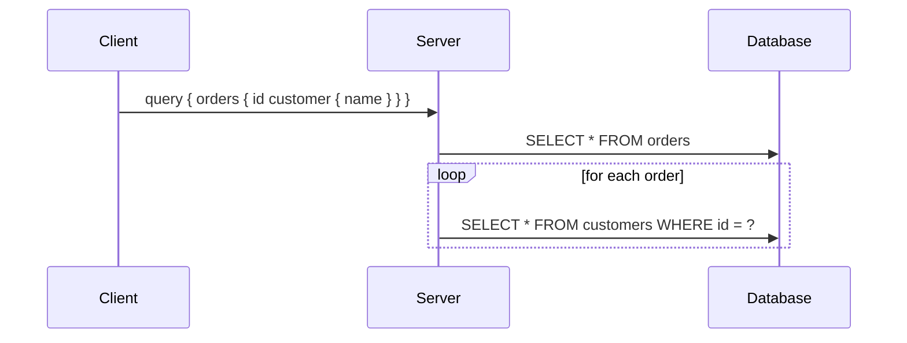

# GraphQL

A query language for APIs where the client specifies exactly what shape of
data it needs, and the server resolves it from one or more sources in a
single round trip.

## Schema-first design

Everything starts from a strongly-typed schema (SDL):

```graphql
type Order {
  id: ID!
  status: OrderStatus!
  items: [OrderItem!]!
  customer: Customer!
}

type Query {
  order(id: ID!): Order
}
```

The schema is the contract — clients can introspect it to know exactly
what's available, which tooling (autocomplete, codegen) relies on heavily.

## Resolvers

Each field has a resolver function that knows how to fetch its value,
independent of other fields. This is GraphQL's core trade-off: flexibility
for the client, complexity pushed to the server to resolve an arbitrary
combination of fields efficiently.

## The N+1 problem

Naively resolving `Order.customer` for a list of 100 orders triggers 100
separate customer lookups (one per order) on top of the 1 query for the
orders themselves — 101 queries total.



**Fix:** batch and cache lookups within a single request using a
**DataLoader** pattern — collect all the customer IDs needed across the
request, then issue one `WHERE id IN (...)` query.

## Trade-offs vs REST

| | REST | GraphQL |
|---|---|---|
| Over/under-fetching | Common (fixed response shape) | Client controls exact shape |
| Caching | Simple (HTTP caching by URL) | Harder (single endpoint, POST-based) |
| Learning curve | Low | Higher (schema, resolvers, N+1 awareness) |
| Best fit | Simple CRUD, public APIs | Complex/nested data, many client shapes (mobile vs web) |
