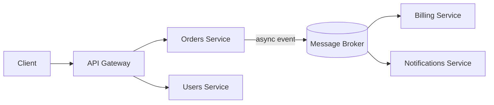

# Microservices

Independently deployable services, each owning its own data, communicating
over the network instead of in-process function calls.

## Finding service boundaries

The most reliable heuristic is Domain-Driven Design's **bounded context** —
split along areas of the business where a term means one specific thing.
Splitting by technical layer (a "database service") is a common mistake:
it creates services that always change together, which is worse than a
monolith with none of the benefits of either approach.

## Communication patterns

- **Synchronous** (REST/gRPC) — simple, immediate response, but couples the
  caller's availability to the callee's.
- **Asynchronous** (events/queues) — decoupled, more resilient to downstream
  slowness, harder to trace end-to-end.

## Data ownership

Each service owns its database exclusively — no other service queries it
directly. Cross-service data needs go through the owning service's API or
via events, never a shared database table.

## Distributed transactions: sagas

No cross-service ACID transaction is possible once each service has its
own database. A **saga** breaks a business transaction into a sequence of
local transactions, each with a compensating action to undo it on failure:

1. Reserve inventory
2. Charge payment
3. If charge fails → release inventory (compensating action)

- **Orchestrated** — a central coordinator drives each step explicitly.
- **Choreographed** — each service reacts to the previous step's event; no
  central coordinator, but harder to see the overall flow.

!!! warning "Microservices aren't free"
    They trade development-time simplicity for operational complexity:
    distributed tracing, service discovery, network failure handling, and
    eventual consistency all become the team's problem. Worth it when org
    size or independent-scaling needs justify it — not a default.
